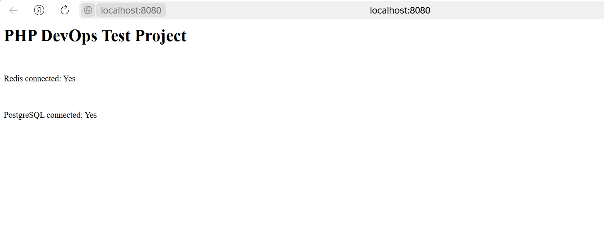

# PHP DevOps Test Project with Nginx Monitoring

## Состав проекта

| Сервис             | Назначение                                                        |
|--------------------|-------------------------------------------------------------------|
| **PHP (FPM)**      | Обработка бизнес-логики, подключение к PostgreSQL и Redis         |
| **Nginx**          | Веб-сервер, проксирует запросы к PHP и отдает статику             |
| **PostgreSQL**     | Основная база данных (v15)                                        |
| **Redis**          | Кэш и in-memory хранилище                                         |
| **Prometheus**     | Сбор метрик с сервисов                                            |
| **Grafana**        | Визуализация метрик                                               |
| **nginx-exporter** | Экспорт `/nginx_status` метрик в формате Prometheus               |

---

## Запуск

```bash
docker-compose up -d
```

## После запуска:

Приложение: http://localhost:8080


Prometheus: http://localhost:9090

Grafana: http://localhost:3000 (логин: admin / admin)


